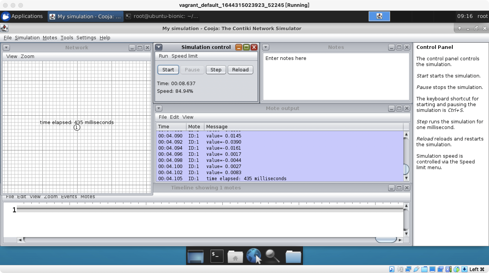
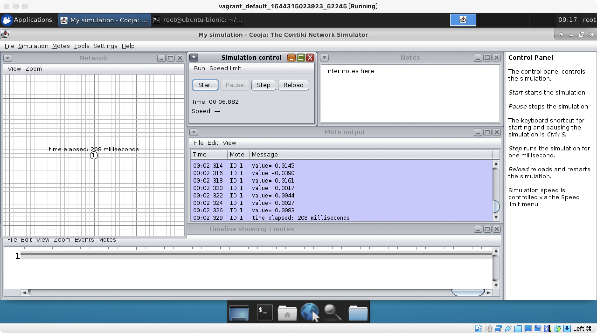
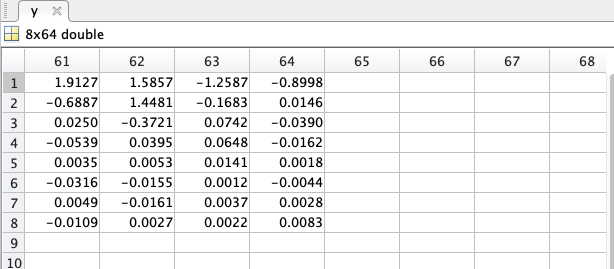

Screen shot with matrix mode in Cooja:

Screen shot with fast mode in Cooja:

We can see that fast mode is around twice faster than matrix mode. 

And the output value(compressed data) is same with matlab result. (focus on last column).

